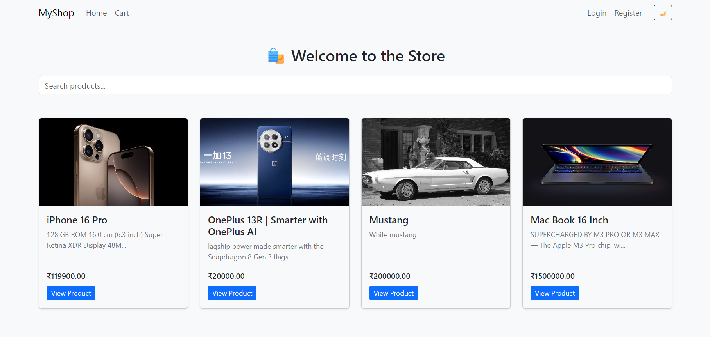

### 📦 HRGF E-Commerce (Django + DRF + React) - Shivam Kuite 🤖

An end-to-end E-commerce web application built using **Django REST Framework** for the backend and **React with React-Bootstrap** for the frontend. It supports user authentication, product management, cart functionality, order placement, and a basic admin dashboard.

---



---

## 🔗 Live Repository

[👉 View on GitHub](https://github.com/ShivamKuite07/HRGF-E-Commerce-Django)

---

## 🚀 Features

### 🛠 Backend (Django + DRF)

* JWT-based User Authentication (Login/Register)
* Product listing, detail, add, edit, delete (admin/user who added it)
* Add to Cart, Update Cart, Remove from Cart
* Order Placement with simulated payment (`calling_razorpay`)
* Order History (per user)
* Admin APIs for:

  * Managing all products
  * Viewing all orders
* Poster Image support for products
* Stock management with validation

### 💻 Frontend (React + React-Bootstrap)

* Responsive product list and detail pages
* Search filter for products
* Login and Register forms with styled cards
* Add to Cart / View Cart UI
* Checkout flow
* Order Confirmation and Order History views
* Admin Dashboard:

  * Product Management (Add/Edit/Delete)
  * Order Management (View All Orders)
* Authentication-aware navigation and route protection

---

## 🧪 Fake Payment Function

```js
// Simulates Razorpay, always returns true
def calling_razorpay(user, amount):
    return True
```

---


## 🛠 Installation & Setup

```bash
git clone https://github.com/ShivamKuite07/HRGF-E-Commerce-Django.git
cd HRGF-E-Commerce-Django
```

### 🔧 Backend (Django)

```bash
# Create virtual environment
python -m venv venv
source venv/bin/activate  # or venv\Scripts\activate on Windows

# Install dependencies
pip install -r requirements.txt

# Run migrations
python manage.py migrate

# Create superuser (admin)
python manage.py createsuperuser

# Start server
python manage.py runserver
```

### 💻 Frontend (React)

```bash
# Navigate to frontend folder
cd frontend

# Install dependencies
npm install

# Start development server
npm run dev
```

---

## 📂 Project Structure

```
HRGF-E-Commerce-Django/
├── backend/
│   ├── accounts/       # JWT auth
│   ├── products/       # Product model & views
│   ├── cart/           # Cart logic
│   ├── orders/         # Order model, views
│   └── media/          # Poster image uploads
│
├── frontend/
│   ├── components/     # Navbar, cards, etc.
│   ├── pages/          # Home, Login, Cart, etc.
│   ├── context/        # Auth + ThemeContext
│   └── index.css

```

---

## 🔒 Admin Credentials (Dev)

Create via:

```bash
python manage.py createsuperuser
```

Use the admin user to manage orders and products via admin dashboard UI.

---

## 📚 Technologies Used

* Backend: Django, Django REST Framework
* Frontend: React, React-Bootstrap, Axios, React Router
* Auth: JWT
* Styling: Bootstrap 5
* Tools: Vite, VS Code

## Note: For more details on the architecture, refer to [ARCHITECTURE.md](ARCHITECTURE.md).

---

## 🙋‍♂️ Author

**Shivam Kuite**
[Portfolio](http://portfolio.cosmicai.in/) | [Email](mailto:shivamkuite77@gmail.com)

---

## 🏁 Future Improvements

* Real Razorpay/Stripe integration
* Pagination
* Product reviews & ratings
* Responsive design upgrades
* Upload multiple images per product
* Dockerize deployment

---
